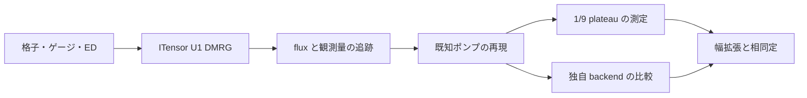

# U(1) cylinder DMRG とスピン flux 挿入のロードマップ

作成日: 2026-09-19。対象は、特に指定がない限り、スピン 1/2 の最近接反強磁性
kagome Heisenberg 模型の飽和磁化比 `M/Msat = 1/9`。
これは研究・実装計画であり、以下の DMRG 機能や物理的結論はまだ実装・検証されていない。

## 目的と採用方針

円周方向に保存量 `Sz` の flux を挿入し、長手方向のスピン移送から
無次元 Hall 応答 `σxy^Sz = ΔSz_right(2π)` を測定する。
ユーザーが提示した U(1)-SET の 3 候補を検証対象とし、模型での実現は仮定しない。

| 候補の代表例 | K | t | c₋ | σxy^Sz | トーラス縮退数 | γ = log D |
| --- | --- | --- | ---: | ---: | ---: | --- |
| SU(3)₁ 型 | `[2 -1; -1 2]` | `(1,0)` | 2 | 2/3 | 3 | ½ log 3 |
| Hall 応答を持つ D(Z₃) 型 | `[0 3; 3 0]` | `(1,1)` | 0 | 2/3 | 9 | log 3 |
| Hall 応答を持たない D(Z₃) 型の一例 | `[0 3; 3 0]` | `(1,0)` | 0 | 0 | 9 | log 3 |

表は指定した K, t から計算した予測。最後の行の t はゼロ応答の具体例として選んだ。
縮退数はトポロジカルな寄与であり、別途生じ得る対称性の破れによる縮退を含めない。
符号は flux と移送方向の規約による。同じ内在的秩序でも t によって応答が異なる。
2/3 のポンプだけでは最初の 2 候補を区別できず、ゼロのポンプだけでも
D(Z₃) 型と自明相を区別できない。

推奨する順序は **ITensors.jl + ITensorMPS.jl による基準実装 → 既知相で検証 →
1/9 plateau の測定 → 計測したボトルネックに対する独自 cylinder DMRG の改良**。
格子・flux・観測量・保存形式は両バックエンドで共有する。
数式、ゲージ、状態追跡、判定上の注意は
[詳細設計](docs/flux_insertion_design.md)に記載する。

## 現在地

- Julia パッケージ、DMRG 本体、テスト基盤は未整備。
  `Project.toml` と実行可能な最小例を含め、P0 から整備する。
- `../SUNDMRG.jl` は伝統的な SU(N) block DMRG、MPI、GPU、保存処理の参考になる。
  一方、SU(N) 既約表現・縮約係数と `Float64` に依存しており、flux 対応の U(1)
  エンジンにそのまま転用できる構造ではない。
- U(1) DMRG、flux driver、観測量の実装はこれから着手する。

## 実装方式の比較

| 論点 | ITensors / ITensorMPS を使う | 独自に改良する cylinder DMRG |
| --- | --- | --- |
| 最初の動作確認 | QN、複素 MPO/MPS、DMRG、期待値計算を利用できる | U(1) ブロック、複素演算、正準化、切断を整備する必要がある |
| cylinder の扱い | 円周 PBC、軸 OBC の格子を一次元 MPS に写す | 同じ格子を使い、site ordering と接続演算子を専用化できる |
| flux 挿入 | OpSum の境界ボンド係数を変更し、前の MPS を初期値にする | flux 非依存の演算子・縮約計画を再利用し、係数更新を軽量化できる |
| 状態追跡 | 適応刻み、検証、再試行を外側の driver に実装 | sweep、局所固有値探索、複数候補の追跡まで制御できる |
| 性能改善 | MPO 構成、QN ブロック、CPU threading を実測比較 | block GEMM、作業領域再利用、sector ごとの負荷分散を設計できる |
| GPU | QN block-sparse の動作・速度は要検証 | 必要な複素 U(1) カーネルを限定して最適化できるが開発負担が大きい |
| 検証方法 | 小系の独立した厳密対角化と比較 | 厳密対角化に加え、ITensor 基準実装とも比較 |
| 主なリスク | warm start だけでは目的の枝の追跡を保証しない | 誤差に加え、charge・共役・切断・観測量の実装誤りが増える |

独自版にも有限幅のエンタングルメントによる計算量増大は残る。
専用化だけで幅に対する指数的な困難が消えるとは想定しない。
まず ITensor のテンソル層を使って sweep/環境管理だけを独自化する中間段階を設け、
全面的な block-sparse 実装は実測結果で判断する。
MPS/MPO/DMRG の現在の提供先は ITensorMPS.jl。
GPU の QN 対応には公式文書でも制約が示されている。
[パッケージ構成](https://github.com/ITensor/ITensors.jl)、
[GPU 対応](https://docs.itensor.org/ITensors/stable/RunningOnGPUs.html)。

## マイルストーンと完了条件

| 段階 | 実装・調査内容 | 完了条件 |
| --- | --- | --- |
| P0: 格子と物理規約 | Project/test 基盤、wrap vector、site ordering、有向 bond と winding、固定磁化、独立した小系 ED | 二重計数なし、Hermitian、U(1) 保存、局所 flux がゼロ、円周 flux が θ、2π 周期、ゲージ変換を数値確認 |
| P1: ITensor 基準実装 | `conserve_qns=true`、ComplexF64、二サイト DMRG、複数初期状態、観測量・checkpoint | θ=0 と一般の θ で ED のエネルギー・密度・相関を再現。再開して同じ観測量が得られる |
| P2: flux continuation | 同じ site indices、前段 MPS、適応刻み、枝の診断、rollback、0→2π→4π→6π、逆方向 | 不連続・未収束を検出して結果を未確定にできる。左右の移送、複数 cut、Schmidt charge が整合 |
| P3: 既知モデルで検証 | 既知の kagome CSL による ±1/2 ポンプと、flux に依存しない自明な零応答対照 | 刻み・bond dimension・長さを変えて既知応答を再現。小さな cylinder だけで量子化を断定しない |
| P4: 1/9 plateau | 2/3 と 0 を同等に検証。VBC、磁化変調、chirality、neutral excitation、端の影響を調査 | 誤差・枝の品質・有限サイズ依存を付した ΔSz(θ) を出力。値が量子化しない場合もそのまま報告 |
| P5: 独自 CPU backend | U(1) block 実装または専用 sweep、flux 係数分離、環境管理、QN の再配分 | ED/ITensor と同精度の物理量を再現し、同じ収束条件で時間・メモリを比較 |
| P6: 幅の拡張・相同定 | 必要に応じ GPU/MPI、iDMRG、複数セクター、幅依存 EE、momentum polarization 等 | SU(3)₁ と D(Z₃) の識別に独立した証拠が得られる、または識別不能な範囲を明記 |

P0–P3 を最小の測定基盤、P4 を最初の研究成果物とする。
P5–P6 は性能・物理上の必要性が確認された段階で進める。
所要日数や最大 cylinder 幅は、P1 の実測前には確約しない。



## 独自 cylinder DMRG で優先する改良

1. **格子専用化と演算子の再利用。** 全サイトを保持する MPS を基本とし、切断を跨ぐ
   接続数と MPO bond dimension が小さくなる順序を比較する。
   seam gauge の `H(θ) = Hfixed + cos(θ) Hcos + sin(θ) Hsin` を利用する。
   flux 更新時に古い Hamiltonian の環境を誤用しない。
2. **U(1) と複素数の正しさ。** 整数 charge `q=2Sz`、演算子の Δq=0,±2、
   Hermitian 内積と SVD/密度行列を実装する。SU(N) の係数・縮退重みは持ち込まない。
3. **切断と continuation の改善。** 全 charge sector の重みから総 bond dimension を配分する。
   二サイト法で charge sector を増やせる状態を確保した後、一サイト法と subspace expansion
   の導入を検討する。ポンプ中に sector の集合を固定して移送を妨げない。
   [subspace expansion の原論文](https://arxiv.org/abs/1501.05504)。
4. **計測に基づく並列化。** contraction、SVD、Krylov、MPO 構築、I/O の内訳を採る。
   まず CPU の block 並列と BLAS 並列を比較し、次に大きい block の GPU 処理を試す。
   一つの continuation 内の θ 点は依存するため独立ジョブとして分散しない。
   サイズ・初期状態・chirality の異なる走行は独立に実行できる。
5. **iDMRG は次段階。** 無限 cylinder では端の蓄積の代わりに、背景を差し引いた
   Schmidt charge の連続変化を測る。単位胞の充填整合性と charge 原点の追跡が追加で必要。

円周全体を一つの物理 site にする方式は局所次元が `2^(3Ly)` になるため初期採用しない。
円周方向の運動量を使う方式も、spin の局所代数と相互作用の表現を別途設計する必要があり、
実空間版の検証が済んでから検討する。

## 提案するコードの分割

以下は将来の配置案であり、現在存在する API を表していない。

```text
src/lattice.jl              # 座標、bond、winding、順序、cut
src/model.jl                # Heisenberg/XXZ、基準モデル、ゲージ
src/backends/itensor.jl     # 基準となる U(1) MPS/MPO/DMRG
src/backends/custom_u1.jl   # P5 以降
src/continuation.jl         # θ の追跡、採否、再試行
src/observables.jl          # 実空間と Schmidt charge、chirality
src/checkpoint.jl           # 再開、設定照合、許可したメタデータの保存
test/reference_ed.jl       # DMRG と独立したスピン基底での実装
examples/flux_pump.jl       # 再現可能な最小実行例
```

最初の実装単位は **P0 と P1 の小系照合まで**。
次に P2/P3 を一つの測定系として完成させ、そこで得た性能から独自化の範囲を決める。
保存する設定は明示的に選び、ローカルのネットワーク設定・接続情報は
[AGENTS.md](AGENTS.md) の指示どおり記録しない。
