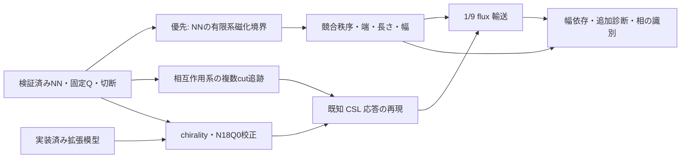

# U(1) cylinder DMRG とスピン flux 挿入のロードマップ

更新日: 2026-09-19。対象は、特に指定がない限り、スピン 1/2 の最近接反強磁性
kagome Heisenberg 模型の飽和磁化比 `M/Msat = 1/9`。

**次の優先課題は、最近接1/9の静的な磁化境界と競合秩序。**
NN模型のN18・θ=0・Q=0,2,4を最初の限定研究とし、次にN27の資源pilotへ進む。
既知CSL側のchirality校正・拡張模型N18Q0照合は並行する。
CSLの非零応答再現は1/9ポンプの解釈の条件とし、静的NN研究の開始を待たせない。
選択肢の比較、一次文献、具体的な計算予算は
[更新した研究方針](docs/research/p4_static_plateau_strategy.md)にまとめる。
明示的な整数 Q の共通 API を追加し、NN模型の N12Q0 と N9 の隣接磁化を
独立 ED と照合した。[明示Qの検証](docs/research/p3_explicit_charge_validation.md)。
J1–J2–J3 の幾何・保存・bond energy も実装し、N12Q0・θ=0,0.37 がEDと一致した。
[拡張模型の検証](docs/research/p3_extended_model_validation.md)。
QN 切断の保持次元・誤差報告を修正し、独立校正と 18 サイトの χ=128,256,512 比較を完了した。
χ=256 の guard 停止は解消したが、χ=128,256 の精度不足は 12 sweep でも残る。
χ=512 は切断なしで ED と一致した。この有限 χ の限界を踏まえ、
既存APIを使った静的sector比較、複数cutの追跡、既知CSL対照へ進む。

本書の「完了」は記載した検証範囲に限る。1/9 plateau の成立、量子化ポンプ、
微視的模型の相同定は未達である。未着手と記した走行・API は実施前の計画として扱う。

## 目的と採用方針

円周方向に保存量 `Sz` の flux を挿入し、長手方向のスピン移送から
無次元 Hall 応答 `σxy^Sz = ΔSz_right(2π)` を測定する。
ユーザーが提示した U(1)-SET の 3 候補を検証対象とし、模型での実現は仮定しない。

| 候補の代表例 | K | t | c₋ | σxy^Sz | トーラス縮退数 | γ = log D |
| --- | --- | --- | ---: | ---: | ---: | --- |
| SU(3)₁ 型 | `[2 -1; -1 2]` | `(1,0)` | 2 | 2/3 | 3 | ½ log 3 |
| Hall 応答を持つ D(Z₃) 型 | `[0 3; 3 0]` | `(1,1)` | 0 | 2/3 | 9 | log 3 |
| Hall 応答を持たない D(Z₃) 型の一例 | `[0 3; 3 0]` | `(1,0)` | 0 | 0 | 9 | log 3 |

表は指定した K, t から計算した予測。最後の行の t はゼロ応答の具体例として選んだ。
縮退数はトポロジカルな寄与であり、別途生じ得る対称性の破れによる縮退を含めない。
符号は flux と移送方向の規約による。同じ内在的秩序でも t によって応答が異なる。
2/3 のポンプだけでは最初の 2 候補を区別できず、ゼロのポンプだけでも
D(Z₃) 型と自明相を区別できない。

研究は二つの流れで進める。**最近接1/9の静的sector比較 → 競合秩序・端・サイズ依存**を
優先し、**相互作用系の追跡検証・既知CSLの測定校正**を並行する。
両者を揃えてから1/9の全cycle輸送を物理的に解釈する。
基準模型は `Jxy=Jz=1,J2=J3=0`。文献の `h/J≈0.35–0.42` は探索の出発点であり、
この円筒の境界をそこに合わせる条件ではない。固定Qでは一様磁場が定数になるため、
hごとのDMRGではなくsector間の全交換エネルギーを比較する。
独自 backend と GPU/MPI は、精度を揃えた計測で必要性が確認された処理から導入する。
格子・flux・観測量・保存形式は両バックエンドで共有する。
数式、ゲージ、状態追跡、判定上の注意は
[詳細設計](docs/flux_insertion_design.md)に記載する。

## 現在地

| 対象 | 実装・確認できたこと | 残る制限と記録 |
| --- | --- | --- |
| 格子・模型・ED | NN bond、winding、U(1)、Hermiticity、局所／円周 flux、2π 周期、ゲージ同値性 | 最近接模型での P0 検証。拡張模型は別途再検証する。[P0](docs/research/p0_reference_validation.md) |
| 明示Q | 初期化・DMRG・保存・継続・独立EDに整数Qを伝搬。NNのN12Q0とN9Q=−1,1,3の計5点が独立EDに一致 | N18Q0は基底数・上限契約のみ確認。CSL・plateauの検証ではない。[検証記録](docs/research/p3_explicit_charge_validation.md) |
| 拡張交換・bond energy | J3を六角形対向頂点に限定。独立平面幾何、family保存、各bond energyとN12Q0の2点を照合 | 最大独立残差≤`4.19e-13`。chirality・N18Q0・CSLポンプは未検証。[検証記録](docs/research/p3_extended_model_validation.md) |
| 基準 DMRG | 9 サイトおよび 18 サイトの複素状態を独立 ED と照合 | 小系での一致。有限 χ の一般的な精度保証ではない。[18 サイト](docs/research/p2_interacting18_validation.md) |
| 切断 | 局所版 NDTensors 0.4.31+1 を固定。密行列校正、捕捉入力 replay、N18 中央 bond 168 更新で保持 rank と損失が一致 | CPU 複素 SVD/Hermitian の検証範囲。hard maxdim は縮退空間を分割し得る。[修正・校正](docs/research/p1_qn_truncation_calibration.md) |
| 保存・Schmidt | 原子的保存、受理／試行分離、絶対左電荷。ロード済みコードの identity を保持し、編集後の誤った hash 付替えを拒否 | 同一 source/runtime の再開。途中 sweep・異なる版への移行は未実装。[保存](docs/research/p1_restart_schmidt_validation.md)、[履歴修正](docs/research/p1_qn_truncation_calibration.md#保存する実行履歴の修正) |
| flux 追跡 | 受理・棄却・刻み半減・復元。零応答対照で `0→6π→0` と再開 | 相互作用系の全 cycle、研究サイズの枝選択は未検証。[P2 初期検証](docs/research/p2_continuation_validation.md) |
| 18 サイト相互作用系 | χ=512 の四経路 `0→±0.37→0`、延べ 24 保存点が ED と一致。刻み・seed の移送差 ≤`4.21e-13` | χ=512 は最大固定 Q rank 386 を切らない。χ=128 は初期点を棄却。cut は一つで内部 bulk がない。[研究記録](docs/research/p2_interacting18_validation.md) |
| 修正後の有限 χ | θ=0,0.37 の計 10 trial 点。χ=512 の残差 ≤`7.18e-12`、χ=256 は約`1.6–1.8e-3`、χ=128 は約`2.5–2.7e-2` | χ=128,256 は ED 比較基準未達。6→12 sweep だけでは解消しない。新しい受理済み continuation 経路ではない。[比較表](docs/research/p1_qn_truncation_calibration.md#18-サイトの結果) |
| 既知 CSL 対照 | 原著監査、Q指定、J2/J3交換のN12小系照合まで完了 | chirality・枝準備・CSLポンプ計算は未実施。原著の端・入力条件には未取得項目がある。[P3 設計](docs/research/p3_csl_control_design.md) |

変更前の Julia 1.13.0 統合 `Pkg.test()` は **4,348 assertions** が成功した。
切断修正時の独立校正 **3,783 件**・backend 回帰 **346 件**、最終保存・再開の重点検証
**109+20 件**が成功した。変更後の全体実行は中断し、ユーザーの方針で重点検証へ
切り替えたため、新たな全体 suite 成功とは扱わない。[実行範囲](docs/research/p1_qn_truncation_calibration.md#テスト実行の範囲)。
その後、重複したテストと組合せを削除した。現在の実行方法・確認結果は
[テストガイド](test/README.md)に記載する。
両 manifest は局所版を固定する。今回の検証は Julia 1.13.0 で実行し、
Julia 1.12.7 は依存再解決までとして、未実行の版へ成功を広げない。
各結果の数値・設定・source hash はリンク先を正本とし、新しい計算で過去の記録を上書きしない。

## 直近の着手順と判定

### 1. 完了: QN 切断の修正と有限 χ の小系校正

二・四サイト例と N18 χ=256 の失敗入力で、global spectrum と sector ごとの
閾値判定が食い違う原因を再現した。保持集合を一度だけ選ぶ局所修正を固定し、
SVD/Hermitian eigen、複素 QN、左右、maxdim/cutoff、noise の独立校正を行った。
実模型の同じ失敗入力は四通りの分解で rank 256 と正しい損失を返す。
guard を保った N18 比較では χ=128,256 の精度不足も保存した。
これは上記小系の検証単位の完了であり、研究サイズや一般非 Hermitian/GPU の保証ではない。

成果物は [再現・限定修正・比較表・source hash 付き記録](docs/research/p1_qn_truncation_calibration.md)。
途中の計算と全体テストの中断も記録し、最終コードを使った結果として付け替えていない。
明示 Q と拡張交換のN12小系検証も完了した。次は以下の静的NN研究を優先し、
CSL側で必要な残る校正を並行する。

### 2. 最優先: 最近接1/9の静的sector比較

最初の研究単位は `(Lx,Ly)=(2,3),N=18,θ=0` の `Q=0,2,4`。
各sectorで独立EDとDMRGを一回ずつ比較し、全交換エネルギーから
`h−=E0(2)−E0(0)`、`h+=E0(4)−E0(2)` と列別の磁化差を記録する。
χ=512、6 sweeps、seed=11、cutoff=noise=0を出発点とし、精度未達sectorだけ
予算内で6 sweepsを一回追加する。飛び越しの確認が必要ならQ=6のEDを加える。
総wall上限10分、Julia/BLAS各1 thread、数値process一つを割り当てる。
未探索Q・未収束sectorを残したまま全磁化に対する安定性を宣言しない。

この単位は有限クラスターの境界・不確かさ・端への磁化分布を報告すれば完了できる。
bulk plateau、中性ギャップ、相同定までを一括した完了条件にはしない。
次に `(3,3),N=27,Q=3` の代表1点を別の10分上限で測り、その費用・精度を見て
隣接Q、χまたは初期状態の比較を選ぶ。全面的な直積走査は行わない。
さらに同じwrapと端で `(6,3),N=54` を候補とする。
境界の一般式・停止条件・geometry・未実装の解析は
[静的研究の段階A–D](docs/research/p4_static_plateau_strategy.md)を参照。

### 3. 並行: CSLに必要な残る観測量・小系照合

既定の 1/9 を保った明示的な整数 Q の指定は実装・小系検証済み。
`−N≤Q≤N` と N との偶奇一致を検証し、初期 MPS、DMRG、continuation、
baseline、checkpoint、独立 ED へ同じ Q を渡す。Q・模型・site identity の
不一致を再開時に拒否する。既存 schema 1 を維持し、旧ソースのsnapshotは
source identity不一致で拒否する。NNのN12Q0・θ=0,0.37とN9Q=−1,1,3の計5点は
energy/site誤差≤`1.26e-15`、独立残差≤`9.39e-13`でEDと一致した。
今回完了した範囲と計算時間は[研究記録](docs/research/p3_explicit_charge_validation.md)に分ける。

別名の J1–J2–J3 builder、全結合の winding、family保存、bond energy を実装した。
J3 は六角形の対向頂点に限定し、production のテンプレートと独立な平面NN graphの
六角形探索で照合した。N12Q0、J1=1・J2=J3=.5のθ=0,.37は独立EDと一致した。
最大残差≤`4.19e-13`、各bond energy誤差≤`5.07e-14`。
次に方向付き三角形のscalar chiralityを追加し、三spin行列で向き・符号を校正する。
chirality はまず観測量として追加し、Hamiltonian に加える seed 項は必要になった段階で
別実装とする。非零 flux のゲージ間比較では観測演算子も状態と同じ規約で変換する。

この共通 API・拡張模型の全体完了条件は NN の既定動作を保ち、拡張模型でも
`N=12,Q=0` の零・一般 flux で
ED/MPO/DMRG とゲージを照合し、`N=18,Q=0` でも残差・射影・移送を検証すること。
後者の ED 次元48,620への helper 対応と基底数は確認済みだが、Q0のN18数値照合は未実施。
計算量の制限を保つ。N=12 は軸 cut がなく、N=18 は一つだけであり、
どちらも半整数ポンプの再現を合格条件にしない。

### 4. 複数 cut のある相互作用系で追跡を検証する

切断校正後の NN 対照はまず `(Lx,Ly)=(3,3),N=27,Q=3` とする。
二つの幾何学 cut があるが、三列で十分な bulk ができるとは仮定しない。
静的pilotで得た代表初期点を起点に、必要なχと別seedを選択的に比較し、
通過した精度設定についてのみ短い正負flux往復と半分の刻みの別走行を行う。
全seed×全χの実行は必須にしない。開始時の刻みは 18 サイトの実測を
参考に決め、閾値・最小刻み・試行数上限を走行前に保存する。

長さを例えば `Lx=3→6`、wrap を `3a2` に固定して増やし、切断誤差・residual/variance・
複数 cut の移送・中央密度・Schmidt 電荷・戻り道を比較する。
監視する中央領域と端から除外する列数を走行前に指定し、端除外幅への依存も調べる。
global overlap だけで枝を認定せず、縮退始点や端の再配置で追跡不能なら
`unresolved` として原因を分ける。初期点の精度不足、分解異常、枝の急変に
同じ「θ 刻み半減」を適用しない。

完了条件は、相互作用を持つ系で cut・χ・刻み・seed・長さへの依存を数値化し、
不連続の棄却と正しい checkpoint からの再開を確認すること。
局所 Krylov の収束情報は取得可否を明記し、設定 tolerance を実測 residual と呼ばない。
取得できない場合は独立 residual を得られる小系と、大系の variance・精度変更による
観測量の安定性を区別して報告する。小系 ED の各 θ の基底状態との一致を、
研究サイズの topological branch を選ぶ条件にはしない。
収束フラグを取得する hook を追加する場合も、その通過を全系収束とは扱わない。
variance の差し引きによる丸め誤差の床を併記する。

### 5. 既知 CSL の非零応答を検証する

模型は最近接 1/9 とは分け、実装済みの `J1=1,J2=J3=0.5,Q=0` を対照に使う。
[原著監査](docs/research/p3_csl_control_design.md)に従い、原著の有限 cylinder と
本計画の site 列・端・整数 QN・seed 条件がどこまで一致するかを先に明記する。
まず `(3,4),N=36` で θ=0 の χ・seed・chirality・計算資源を測定し、
状態準備を検証した後に長さを増やす。原著の 288 サイトへ直接進む計画にはしない。

複素状態から両 chirality の候補を保持する。明示的な chirality seed を加えた場合は、
その係数を除いた後の状態を別に検証する。`0→2π→4π`、負方向と逆走を比較し、
移送の累積値、複数 cut、Schmidt、端への蓄積、枝の履歴を保存する。
完了条件は原著の半整数応答を、符号規約と数値・有限サイズの誤差を付して再現すること。
χ・刻み・長さ・幅への依存を調べ、±1/2 への近さを枝選択や受理条件には使わない。
小系で非量子化・零応答ならサイズ・枝・模型条件を点検し、その結果も保存する。
4π の bulk sector 帰還と全波動関数・端密度の帰還は分ける。

### 6. 最近接1/9のbulk評価と輸送を結び付ける

上記の静的比較を発展させ、必要な周辺Qの下側包絡、端の電荷分布・長さ・幅依存を調べる。
9-siteの√3×√3と27-siteの3×3 VBC、磁気秩序、複素枝を比較する。
現在のwrap=`Ly*a2`では両VBCの周期を許す `Ly%3=0` の円筒を含める。
N27は3×3の一周期にすぎず、N54も狭幅の予備計算である。
Sz・bond energyに加え縦・横相関を用い、固定Qによる横磁化ゼロを秩序なしの証拠にしない。
同じQ内の中性励起とその局在は別の検証単位とする。

既知 CSL の測定検証後、複数初期状態・VBC 等の拡大単位胞と両立する geometry を選び、
最近接模型の `0→2π→4π→6π` と逆走を測る。
磁化・bond energy の変調、chirality、相関、Schmidt flow、端／domain wall の動きを併記する。
2/3、0、それ以外、未収束を同じ基準で保存し、秩序相や gapless 状態を候補から除かない。
6π の bulk sector 周期だけから全縮退数を推定せず、非零 pump だけから SU(3)₁ を選ばない。
相の識別には、sector・entanglement・modular 診断など独立な追加証拠を要求する。

## 実行規模と分担

一回の着手を「一つの修正または小系検証＋報告」に区切る。初期点の実測から
時間・最大メモリ・checkpoint 容量を見積もり、次のサイズと走行上限を決める。
χ やサイズの全面走査、自動的な solver 精度増加、GPU/MPI 導入は当面の必須作業にしない。
既存 driver の seam gauge・noise=0・全点 variance を基準とし、変更時は独立に再校正する。

主担当は共有 API・依存版・保存契約と統合を管理し、切断の独立監査、
幾何／ED、文献／chirality の検証を独立した担当に分ける。一つのファイルは一人が編集する。
各数値 process はまず Julia/BLAS 各 1 thread、theta 列は逐次、独立走行は別出力とする。
並列度を増やす際は合計メモリと CPU を先に配分する。

各段階の成果物は、再現コマンド、選択した設定と source/manifest hash、受理・棄却・
失敗を含む数値、独立照合、残る不確かさ、次の判断を持つ研究記録とする。
source/依存版が変わったら旧 checkpoint の整合性チェックを緩めず、旧環境を保存して
新環境で初期点を作り直すか、別途検証した移行手順を用いる。

## 実装方式の比較

| 論点 | ITensors / ITensorMPS を使う | 独自に改良する cylinder DMRG |
| --- | --- | --- |
| 最初の動作確認 | QN、複素 MPO/MPS、DMRG、期待値計算を利用できる | U(1) ブロック、複素演算、正準化、切断を整備する必要がある |
| cylinder の扱い | 円周 PBC、軸 OBC の格子を一次元 MPS に写す | 同じ格子を使い、site ordering と接続演算子を専用化できる |
| flux 挿入 | OpSum の境界ボンド係数を変更し、前の MPS を初期値にする | flux 非依存の演算子・縮約計画を再利用し、係数更新を軽量化できる |
| 状態追跡 | 適応刻み、検証、再試行を外側の driver に実装 | sweep、局所固有値探索、複数候補の追跡まで制御できる |
| 性能改善 | MPO 構成、QN ブロック、CPU threading を実測比較 | block GEMM、作業領域再利用、sector ごとの負荷分散を設計できる |
| GPU | QN block-sparse の動作・速度は要検証 | 必要な複素 U(1) カーネルを限定して最適化できるが開発負担が大きい |
| 検証方法 | 小系の独立した厳密対角化と比較 | 厳密対角化に加え、ITensor 基準実装とも比較 |
| 主なリスク | warm start だけでは目的の枝の追跡を保証しない | 誤差に加え、charge・共役・切断・観測量の実装誤りが増える |

独自版にも有限幅のエンタングルメントによる計算量増大は残る。
専用化だけで幅に対する指数的な困難が消えるとは想定しない。
まず ITensor のテンソル層を使って sweep/環境管理だけを独自化する中間段階を設け、
全面的な block-sparse 実装は実測結果で判断する。
MPS/MPO/DMRG の現在の提供先は ITensorMPS.jl。
GPU の QN 対応には公式文書でも制約が示されている。
[パッケージ構成](https://github.com/ITensor/ITensors.jl)、
[GPU 対応](https://docs.itensor.org/ITensors/stable/RunningOnGPUs.html)。

## マイルストーンと完了条件

元の P0–P6 の番号を維持し、未完了部分を分けて管理する。

| 段階 | 現在の状態 | 次の完了条件 |
| --- | --- | --- |
| P0: 格子と物理規約 | NN の小系検証は完了 | 模型を拡張するたびに bond・ゲージ・独立 ED を再照合 |
| P1: ITensor 基準実装 | 小系照合・完了点保存・QN 切断校正・N18 の χ/sweep 比較を完了 | より大きい系の精度評価。局所 solver と全系誤差の区別を維持 |
| P2: flux continuation | driver と零応答対照、N18 の短区間は検証済み | 相互作用系の複数 cut、有限 χ、刻み・長さ・seed、棄却／復元を検証 |
| P3a: CSL 模型・観測量 | 明示Q、J2/J3、bond energy・保存契約とN12小系照合が完了 | chiralityの三spin校正、N18Q0の残差・射影・移送を照合 |
| P3b: 既知非零応答 | 未着手 | 同じ枝の `0→2π→4π`、±1/2 応答と数値・サイズ依存を再現。零応答対照も維持 |
| P4a-1: 有限系の磁化境界 | N9の差分を記録。次の優先課題 | 最初の完了単位はN18の3sectorと必要な遠方Q、境界・磁化分布・精度の記録。N27は別の研究単位 |
| P4a-2: 競合秩序・bulk評価 | 未着手。P3と独立に進行可 | 拡大単位胞を許した密度・bond・相関の比較、長さ・幅・端依存。中性励起は別単位で評価 |
| P4b: 1/9 輸送 | 未着手 | P2/P3bの測定検証とP4aの状態評価後に `0→2π→4π→6π` と逆走を比較。非量子化・未解決も誤差付きで出力 |
| P5: 性能改善・独自 backend | 未着手、計測後に選択 | ED/基準実装と同じ物理精度で時間・メモリ・I/O を比較 |
| P6: 幅の拡張・相同定 | 未着手 | 必要な追加 sector・entanglement・modular 診断を実施し、識別できる範囲と限界を明記 |

P0–P3 は測定基盤、P4 は最近接 1/9 の物理評価とする。
P4a-1/2の静的研究を直近で優先し、P3と並行する。
P3b完了をP4aの開始条件にしない。有限系の磁化境界とbulk評価を別々に完了判定する。
P5 は自動的な次段階にせず、P2/P3/P4 の実測で必要になったときに実施する。
P6 で使う GPU/MPI・iDMRG も手段であり、相同定の証拠を代替しない。



## 独自 cylinder DMRG で優先する改良

以下は性能の実測後に選択する候補とする。
`../SUNDMRG.jl` の sweep・workspace・保存・並列化を参考にするが、
SU(N) 既約表現・縮約係数・実数 kernel は複素 U(1) flux 計算にそのまま転用しない。

1. **格子専用化と演算子の再利用。** 全サイトを保持する MPS を基本とし、切断を跨ぐ
   接続数と MPO bond dimension が小さくなる順序を比較する。
   seam gauge の `H(θ) = Hfixed + cos(θ) Hcos + sin(θ) Hsin` を利用する。
   flux 更新時に古い Hamiltonian の環境を誤用しない。
2. **U(1) と複素数の正しさ。** 整数 charge `q=2Sz`、演算子の Δq=0,±2、
   Hermitian 内積と SVD/密度行列を実装する。SU(N) の係数・縮退重みは持ち込まない。
3. **切断と continuation の改善。** 全 charge sector の重みから総 bond dimension を配分する。
   二サイト法で charge sector を増やせる状態を確保した後、一サイト法と subspace expansion
   の導入を検討する。ポンプ中に sector の集合を固定して移送を妨げない。
   [subspace expansion の原論文](https://arxiv.org/abs/1501.05504)。
4. **計測に基づく並列化。** contraction、SVD、Krylov、MPO 構築、I/O の内訳を採る。
   まず CPU の block 並列と BLAS 並列を比較し、次に大きい block の GPU 処理を試す。
   一つの continuation 内の θ 点は依存するため独立ジョブとして分散しない。
   サイズ・初期状態・chirality の異なる走行は独立に実行できる。
5. **iDMRG は次段階。** 無限 cylinder では端の蓄積の代わりに、背景を差し引いた
   Schmidt charge の連続変化を測る。単位胞の充填整合性と charge 原点の追跡が追加で必要。

円周全体を一つの物理 site にする方式は局所次元が `2^(3Ly)` になるため初期採用しない。
円周方向の運動量を使う方式も、spin の局所代数と相互作用の表現を別途設計する必要があり、
実空間版の検証が済んでから検討する。

## コードの分割と実装状況

現在実装したファイルは以下のとおり。公開 API と実行手順は
[English getting started](docs/getting_started.md)を参照。

```text
src/lattice.jl                    # 座標、bond、winding、順序、cut、ゲージ角
src/model.jl                      # 複素 U(1) Heisenberg/XXZ MPO、縦磁場対照
src/dmrg.jl                       # ITensor 単一点 DMRG、実測診断
src/observables.jl                # Sz、zz/+- 相関、実空間移送読み出し
src/schmidt.jl                    # 切断なし Schmidt 分解、絶対左電荷・entropy
src/checkpoint.jl                 # 同一環境の原子的 snapshot、照合・完了点再開
src/continuation.jl               # 診断による受理・棄却、刻み半減、復元、未解決記録
test/reference_ed.jl              # 距離探索格子と独立したスピン基底 ED
test/reference_eigensolve.jl     # 小系 sparse BlockLanczos、明示的な収束・残差照合
examples/validate_small_system.jl # 小系照合と許可リスト式 TOML 記録
examples/validate_restart.jl      # 別 process 再開と ED・Schmidt 照合
examples/validate_continuation.jl # 零応答の往復・再開、ED、縮退による追跡停止
examples/validate_interacting18.jl # 18 サイト相互作用系の精度・刻み・seed・正負 flux 比較
```

chirality、独自 backend、既知 CSL と 1/9 plateau の研究用 pump の実行例は
今後の実装であり、現在の API ではない。

保存する設定は明示的に選び、ローカルのネットワーク設定・接続情報は
[AGENTS.md](AGENTS.md) の指示どおり記録しない。

## 英語リリースへの方針

当面の議論と研究記録は日本語でよい。公開 API、docstrings、エラーメッセージ、
機械可読の保存キーは英語に揃え、英語の導入文書を並行して維持する。
リリース時には README、物理規約、数値検証・制限、再現手順を英語で揃え、
実装・数値証拠・未解決事項の区分を翻訳後も保持する。
ライセンス・著者情報、CI、対応バージョン、保存形式の安定性は公開前に確認する。
