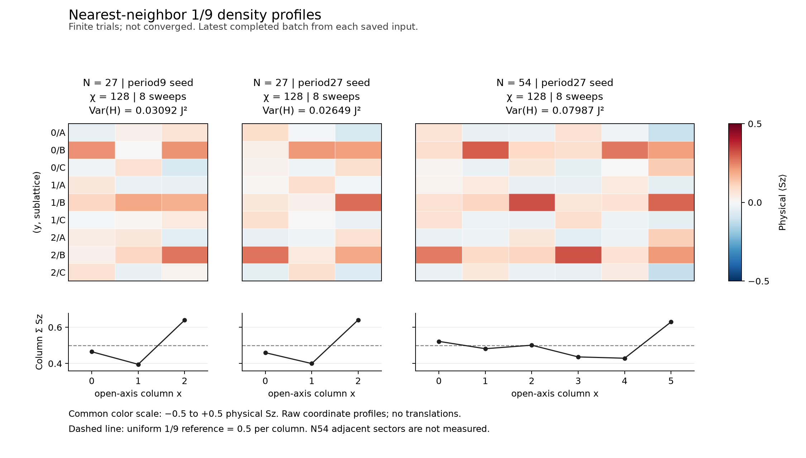

# 最近接1/9の静的比較からCSL対照へ進む研究走行

実施日: 2026-09-19。状態: **項目1〜3の限定走行を実施。静的収束とCSL非零ポンプ校正は未達**。
ユーザーの「項目1〜3まで進める」指示を受け、N27追加収束の保留を解除する。
今回のgoalは、最近接1/9の収束・隣接sector、競合する周期と長さ、
別模型のCSL状態準備・逐次flux校正を、測定結果に従って進めることである。
予想ポンプ・相を達成条件や状態選択に使わない。
2026-09-20のQ1/Q5追加2 sweepsは[別の研究記録](p4_static27_sector_refinement.md)に保存した。
以下の数値とstatusは2026-09-19の走行を表し、後続の結果へ置き換えていない。

| 項目 | 得た結果 | 未達の条件 |
| --- | --- | --- |
| 1. 静的sectorと精度 | N27のQ1/3/5とχ256→512を比較。χ256 trialの磁場区間は約0.25836–0.49397 J | 全trial未収束。遠方Qの飛び越し、bulk plateauは未判定 |
| 2. 周期と長さ | 周期9/27の明示初期状態、N27/N54のSz・bond・相関を比較 | 模様の位置と収束誤差の影響が残る。VBCや端/bulkの分離は未確定 |
| 3. CSL測定対照 | N36のχ128累積6→χ256累積8を保存し、零fluxの初期診断を実行 | χ256でも精度基準を超過し、非零flux未着手。非零ポンプ校正は未達 |

## 共通の実行条件

- 数値workerは同時に一つ、Julia/BLAS各1 thread。各走行は起動・診断込み600秒以内。
- 各configでgeometry、Q、初期状態、保持次元、batchのsweep数と回数を固定する。
- 完了batchごとにtrial checkpointを保存・厳密に再読込してから診断する。
- 時間切れでも完了batchを保持し、部分記録のstatusと外側executionを併読する。
- 親・config・driver・backendのhashを別々に保存し、source identityの検査は緩めない。
- 数値整合性と収束を区別する。変分エネルギー差は厳密な磁場境界の誤差限界ではない。

## 1. N27の収束と隣接sector

最初は保存済みQ3・χ256・累積4 sweepsから追加2-sweep batchを最大2回実行する。
親の生成時と一致する保存backendを使い、現行コードへ由来を付け替えない。
N27生成時からのproduction差はchiralityの追加のみで、DMRG・格子・模型・vendor・manifestは同一。
保存snapshotの元commitは`48d15e2b566b4d4b50a6c5295b84348cc5f30f8d`で、179sourceを監査した。
snapshot配下のGit照会が現HEADを返す場合も、元commit・実行sourceのhashを別に記録する。

固定χの比較目安は、全energy変動/N≤1e−6 J、最大Sz/bond変動≤1e−4、
variance/N≤1e−5 J²、最終sweep最大切断誤差≤1e−6とする。
これを満たしても基底収束とは断定せず、χと初期状態を比較する。
未達量と費用を見て、同χの追加2 sweepsかχ512の比較を一つ選ぶ。
累積8までのχ256走行は580.014秒で完了した。6→8のΔE/Nは−5.84e−7 Jだが、
variance≈0.00733 J²、最終切断誤差4.98e−5が停滞し、Sz/bond profileも変化している。
次は同じ局所solver設定でχ512を比較する。上限600秒、追加総量2 sweepsは維持し、
各1 sweep後に未収束trialを保存・診断する。1-sweep batchに内部sweep差はないため、
前batchとの測定energy差と最終local/expectation差を区別して記録する。
上限内にχ512の1 sweepさえ完了しない可能性もある。その場合も既存状態を変更しない。
実行は598.323秒で打ち切られたが、最初の1 sweep（累積9）と全診断は完了した。
E=−11.305746830785633 J、variance=0.0007406515136665348 J²、
最終切断誤差=3.8014600696051392e−6を保存した。χ256累積8よりEは0.001488782526319 J低く、
varianceは約9.9倍改善した一方、variance/Nと切断誤差は事前目安を超える。
最大Sz/bond変化は0.0071734/0.0101485で、χ拡大と追加sweepによる模様の変動も残る。
この比較はχとsweep数が同時に変わっており、純粋なχ依存を分離したものではない。
χ変更行には固定χのstationarity判定を適用しない。
累積10は未完了で比較対象にしない。workerの最終処理も未完了のため元記録は変更せず、
停止後に親・config・実行source・保存sourceの193 hash検査が通過したことを
`outputs/p4-campaign-nn27-q3-chi512/post_run_hash_audit.json`へ別途保存した。
χ256累積6/8の旧記録はH†Hの虚部を保存していなかったため、保存状態を厳密loadし、
同じbackendで新たな複素収縮を別走行で測定した。52.604秒で2状態とも監査を通過し、
元varianceとの差は0、虚部はそれぞれ1.71e−14/7.86e−15 J²で丸め床以下だった。
旧記録の未測定欄は書き換えていない。監査は同一MPO builderの再測定であり、独立EDではない。
Q1/Q5はQを変更する再開を行わず、新しい状態で同じ精度を目指す。
最初の隣接Qケースは各χ256・seed11・2-sweep batch×最大4、各600秒とする。
取得したsectorの全交換エネルギーから磁場境界を求め、未収束による変動を併記する。
Q1の初回は598.300秒でbatch4中に停止した。累積2/4/6は保存・全診断済みで、
比較に使える最終状態は累積6のE=−11.562622938931032 J、
variance=0.003935861675842034 J²、最終切断誤差=2.6996215407491662e−5である。
4→6でも最大Sz/bond変化0.08814/0.20046が残り、固定χのstationarityは未達。
停止後のsource/config/完了checkpointの195 hash照合を別記録へ保存した。
Q5の初回も598.342秒でbatch4中に停止した。完了した累積6では
E=−10.810283686911795 J、variance=0.004854254992395113 J²、
最終切断誤差=3.4335172032753923e−5で、固定χのstationarityは未達だった。
両隣接sectorとも実保持次元256の完了状態を取得したが、収束は確定していない。

全交換energyと `F_Q=E_Q−hQ/2` を用いると、比較集合Q={1,3,5}で
`h−=E3−E1`、`h+=E5−E3` となる。χ256の最新完了trialからは
`0.2583648907<h/J<0.4939743613`、幅0.2356094707が得られる。
Q3だけをχ512累積9へ置き換えると、`0.2568761081<h/J<0.4954631439`、
幅0.2385870357へ変化する。後者は保持次元が揃わない比較である。
いずれも変分trial energyの差で、厳密な誤差区間ではない。Q7以上の飛び越しとbulk plateauは未判定。

## 2. 周期と端の影響

9-site周期と27-site周期を持つ、電荷を厳密に固定した密度・bondに偏りのある初期状態を用意する。
文献のVBC波動関数そのものと同定せず、実際の周期・初期観測量を記録する。
追加pinning Hamiltonianを使わない場合も、初期状態の偏りを明示する。
N27・Q3で比較し、同じ幅と端のN54・Q6を限定した保持次元・sweep予算で比較する。
初回の二種類のN27 trialはχ128・seed11・2-sweep batch×最大4、各600秒とする。
この比較は同じχで周期の異なる初期状態を比較するもので、χ256のrandom系列との精度一致は仮定しない。
長さのケースは、この二種類の実測後に必要な初期状態を選び、同χを出発点に別途固定する。
未収束状態の模様や短い系の列差を、VBCやbulkと端の分離と同一視しない。
N27の両trialは各8 sweepsを完了した。period9ではE=−11.296541076415831 J、
variance=0.03092317423877944 J²、period27ではE=−11.297703900995645 J、
variance=0.026489284197054985 J²だった。どちらもstationarity未達である。
同じχ・sweep数でより低い試行energyを得たperiod27を、今回の限定した長さ比較の出発点に選ぶ。
これは27-site秩序の選択・同定ではない。N54、(Lx,Ly)=(6,3)、Q6、同じseed11・χ128、
2-sweep batch×最大4、Julia/BLAS各1 thread、包含600秒、別出力を起動前に固定する。
両サイズでperiod27初期模様、wrap、端、原点規則を合わせ、各列および中央x=2,3を比較する。
N54の隣接Qともう一つの初期状態はこの一走行に含めず、長さによる磁場区間や候補優劣は未判定とする。
N27の二つの最終profileのRMS差はSz=0.11680、bond=0.14659だったが、
`period9(x,y,s)`と`period27(x,y+2 mod 3,s)`を比較すると0.03644/0.04608へ減少した。
端を含むx方向は移動させていない。模様の位置差が大きな成分を占めるが、
差は残り、両状態のsweep・保持次元に関する精度不足もあるため、相違を異なるVBCの証拠にしない。

N54は465.278秒で8 sweepsを完了し、E=−22.76188889833083 J、
variance=0.07987155775333576 J²、最終切断誤差2.0515398450591586e−4だった。
6→8の最大Sz/bond変化は0.02179/0.15716で、stationarityは未達。
列磁化は `[0.52217,0.48172,0.50102,0.43643,0.42918,0.62947]`、総和はQ/2=3である。
N27の中央列x=1とN54の中央二列x=2,3を比べると、site当たりSz平均は
0.04442→0.05208と一様値1/18へ近づくが、領域平均からの局所SzのRMSは
0.07228→0.11023へ増えた。中央の列内NN bondの平均は−0.23148→−0.22974 J、
そのRMS変調は0.11397→0.06856 Jである。平均磁化だけでは局所変調の消失を示さない。
同じχ・seed・sweep数でも実際の精度は一致せず、この長さ比較からbulk秩序は確定できない。
N54の隣接Q4/8とperiod9は未計算で、磁場区間の長さ依存や周期候補の優劣は未判定。

[静的比較の全数値](data/p4_campaign_static_comparison.toml)は7ケース・21完了batchを含む。
[集計script](../../examples/summarize_static_campaign.py)は完了・保存検証済みのbatchだけを選び、
timeout時のworker statusと外側executionを別々に保持する。χ変更と固定χ比較を混同せず、
未測定のH†H虚部・1-sweep内energy差は欠測のままとする。
接続Sz相関の中央領域統計とsublattice別の平均を引いた密度Fourier成分も保存した。
N54のFourier成分は選んだ波数だけの記述で、完全なstructure factorや秩序の証明ではない。
[図の由来](figures/p4_campaign_density.provenance.json)には入力・script・画像のhashと選択状態を記録した。

## 3. CSL対照の状態準備とflux

最近接1/9とは別に、J1=1、J2=J3=0.5、Q0で開始する。
N36 `(Lx,Ly)=(3,4)`、零flux、複素seed一つ、χ128、2-sweep batch×最大2を最初のケースとする。
Sz・bond・chirality・variance・切断・cut12/24のSchmidt量と資源を測る。
精度不足なら未達量に応じた追加sweepまたはχ比較を選び、flux基準を結果に合わせて緩めない。
逐次fluxでは同じ受理状態から次をseedし、失敗時は最後の受理状態へ戻って刻みを細かくする。
期待する±1/2への近さを判定に使わない。零・非量子化・未解決も保持する。
非零ポンプの校正には、枝連続性、複数cut、実空間/Schmidt一致とχ・刻み・サイズの検証が必要。
N36の状態準備や一つの短い軌道だけで校正完了とはしない。

最初のflux区間は事前に `0→π/12→0` とし、通常6 sweepsの費用が600秒に
収まらない見込みなら起動前に `0→π/12` のみに限定する。最小刻みπ/48、
最大5 trials、各2 sweepsとする。零flux準備の測定前に次の運用基準を固定した。

| 判定量 | 上限（overlapのみ下限） |
| --- | ---: |
| 正規化overlap振幅 | ≥0.95 |
| 中央列の最大Sz変化 | 0.01 |
| 最大entropy変化 | 0.10 |
| 最大Schmidt平均Sz変化 | 0.05 |
| 総variance | 1e−3 J² |
| 最終sweep実測切断誤差 | 1e−5 |
| sweep/final-expectationの総energy差 | 1e−4 J |
| 累積右移送のcut間差 | 0.01 |
| 電荷・実空間/Schmidt整合性 | 1e−9 |
| 中央bond/chiralityの最大変化 | 各0.01 |

これらは小刻みの有限精度pilotの基準で、原著の収束基準や基底状態誤差限界ではない。
準備がvariance・切断・energy基準を満たさない場合は、未達量を記録して零fluxの
追加sweepまたはχ比較を一つ選ぶ。新しいvariance-enabled baselineにも同じ基準を適用する。
非零thetaの受理に至らなければ、その精度不足を校正の未達理由として保存する。
原著のpump例はN288・最大5000状態であり、今回のN36はその再現と同一視しない
（[Gong, Zhu, Sheng, Scientific Reports 4, 6317](https://www.nature.com/articles/srep06317)）。

初回N36は164.736秒で4 sweepsを完了し、E=−15.896898306045497 J、
variance=0.4529422477173739 J²、最終切断誤差9.470471775361133e−4を得た。
整合性検査は通過したが、3→4 sweepのenergy変動0.211748 Jも残り、flux準備の精度は未達。
エネルギーがなお大きく改善中なので、同じχ128で2 sweepsだけ零fluxを追加する。
親trialは`outputs/p3-campaign-csl36-prepare-chi128/trial/checkpoint-pjHDfN`、
別出力・1 thread・包含600秒とする。閾値を緩めて非零thetaへ進むことはしない。
追加2 sweepsは170.926秒で完了し、累積6のE=−15.946566143769756 J、
variance=0.433047732638272 J²、切断誤差1.1062120778185605e−3を得た。
energyは0.0496678 J改善した一方、varianceの改善は約4.4%で、切断誤差も残る。
次の一単位はχ256の新しいvariance-enabled零flux2 sweepsと、初期gate通過時だけの
π/12への追跡を組み合わせる。包含600秒、1 worker・各1 thread、policyは上表から変更しない。
費用を抑えて最初の非零target一つに限定し、往復はこのcaseの対象外とする。
新baselineの2 sweepsと内部varianceが完了する前に時間切れとなる可能性も保存する。
初期gateで停止した場合は「零flux準備比較、非零flux未着手」と記録し、
以前のtrialへ受理済みラベルを付け替えない。χと追加sweepsの効果は分離されていない。

このχ256走行は538.307秒で零fluxの新しい2 sweeps・分散・保存再読込・全診断を終え、
初期gateで停止した。新trialのE=−16.04147694678745 J、variance=0.24073151474607357 J²、
最終切断誤差6.407760400777702e−4、最後のsweep間energy差0.0058647137673091265 Jだった。
分散・切断誤差・sweep間energy差は上限の約241倍、64.1倍、58.6倍で、`initial_diagnostics`により
`unresolved`と判定された。整合性検査の通過は精度基準の通過を意味しない。
平均chiralityもχ128累積6の0.00399661から0.00128309へ変わり、安定したchiral branchとは言えない。
core journalの`theta_path=[0.0]`、`accepted_checkpoints=[]`、`trials=[]`、
workerの非零flux観測数0を確認した。**零flux準備比較、非零flux未着手**であり、
「零ポンプを測定した」「この模型にCSLがない」という結果ではない。
初期診断にある移送0はbaseline自身との差であり、応答の観測値に数えない。
外側executionの`failed`はworker終了code 2をそのまま表し、この場合は精度未達による
予定された停止である。timeoutや例外停止とは区別し、元statusを書き換えない。
新trialのvarianceは`run_dmrg`内部の測定値であり、H†H虚部の別測定は行っていない。
未測定欄を0で補わず、以前の外部variance測定trialをvariance-enabledへ付け替えてもいない。

[χ256の全測定](data/p3_campaign_csl36_flux_readiness_chi256_validation.toml)、
[外側実行記録](data/p3_campaign_csl36_flux_readiness_chi256_execution.toml)、
[初期診断と棄却理由](data/p3_campaign_csl36_flux_readiness_chi256_trajectory.toml)を保存した。
peak RSSは約3.368 GiB、worker CPU時間535.606秒。各sweep・variance込みの費用が得られたため、
次回のCSL状態準備はこの費用に基づき予算化できる。P3bの非零応答再現は未完了のまま維持する。

## 残る研究上の問い

この時点では、特に変動の大きいQ1とQ5の追加最適化で磁場差の変化を調べる方針とした。
続く[固定χ・累積6→8の比較](p4_static27_sector_refinement.md)では区間幅が約3.99%変わり、
両sectorの分散・切断誤差は増えた。同じχ・sweep数の比較は得たが、精度は揃っていない。
N54はまずsweep/χで中央profileが安定するかを確認し、必要になった隣接Q・初期状態を追加する。
CSL側は非零fluxへ進む前に零fluxの分散・切断を改善する。追加sweepとχ変更は別比較として
評価し、費用の増加も測る。今回の初期診断失敗をfluxの刻み縮小だけで解消できるとは仮定しない。
これらの未達事項はロードマップに残し、今回取得した有限trialを相同定や量子化の証拠へ昇格させない。

## 検証範囲と再現

今回追加したのは研究用driver、初期状態、集計・作図、config、結果と文書で、
productionの`src`は変更していない。次の確認を実施した。

- 周期初期状態はN27/N54×period9/27の4構築を校正し、Q・規格化・rank・Sz・複素pair相関を照合した。
  最大Sz差1.11e−16、bond差3.89e−15、複素pair差2.65e−15、約30.73秒だった。
- 各完了batchで原子的checkpoint保存・厳密reloadと電荷・観測・由来を検証した。
  timeoutした3走行は外側の停止状態を保持し、完了checkpointとhashの監査を別記録へ保存した。
- χ256累積6/8の保存状態を同じbackendで再測定し、H†Hの虚部と元varianceを照合した（52.604秒）。
  この再測定は独立EDの代用ではない。
- 集計のselfcheckは欠測・未完了の除外、磁場式、座標・並進・Fourier・相関・hashリンクを通過した（約0.005秒）。
  別担当も実入力から磁場境界、円周shift、中央/端統計を独立再計算し、図を含む38 hashを照合した。
  この最終38件は入力と成果物の照合で、過去の全backend source監査を再実行したものではない。
- CSL側も別担当が3走行のsource/config/親/新checkpoint/runtimeを照合し、χ256の拒否理由を再計算した。
  workerとcoreのstate payloadの一致、非零flux未実行、baselineとの自明な移送0を確認した。
  この独立レビューはPythonのhash・metadata・算術検査で、MPS再収縮や別のDMRGではない。
- Python4 scriptの構文、config10ファイルのTOML、`git diff --check`を確認した。
  今回の変更では通常のpackage suiteを再実行していない。過去の532件・736件の重点検証を今回の実績には数えない。

caseの再実行は[launcher](../../examples/run_research.py)に`static`または`csl`、
[対応config](../../examples/configs)、新しいoutput directoryと`--wall-seconds 600`を渡す。
旧NN checkpointからの再開には保存した179-file backendと一致する環境が必要で、
現行backendへsourceラベルを付け替えて再開しない。比較・図の再作成は新しいDMRGを必要としない。
hashを含む原記録は[data](data)に複製し、巨大なMPS本体は各`outputs/`のtrialに保持した。
source snapshotとcheckpoint本体はローカル成果物であり、文書だけで別環境の厳密再開はできない。
