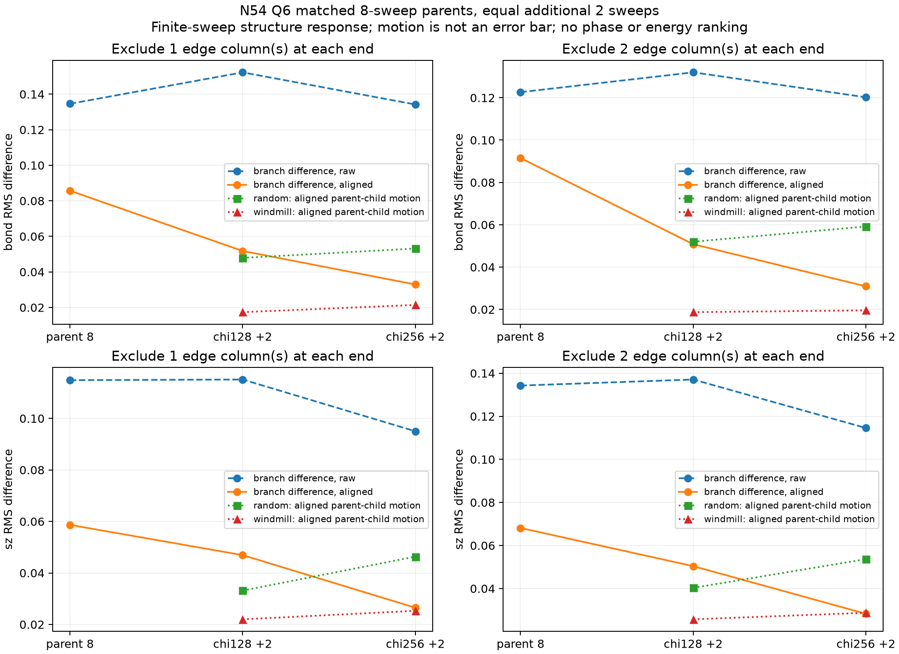
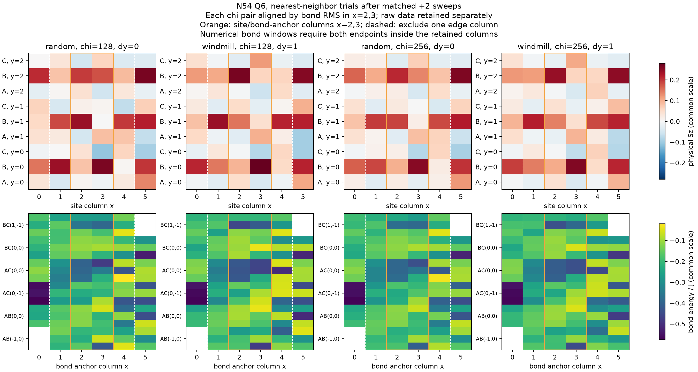

# N54・Q6: 同一親からのχ128/256・追加2 sweeps比較

2026-09-22。対象は最近接・等方Heisenberg模型、θ=0。
[初回の準備比較](p4_vbc54_preparation_comparison.md)のrandom／windmill各8-sweep親から、
χ128／256で同じ追加2 sweepsを行い、中央構造差に対する緩和不足とχ制限の影響を調べる。
選択理由は円周整列後の中央bond差が最大だったことで、trial energy順位ではない。

**4ケースを34.45分で実行・保存・診断した。χ増加で分散と切断誤差は改善し、中央構造差も縮んだが、
全4ケースで5精度条件すべてが未達だった。** 端2列除外の整列後bond RMS差は
親の0.0915287 Jから、χ128子で0.0508213 J、χ256子で0.0309135 Jへ縮小した。
残る差はrandom枝自身の緩和・χ変更による変化より小さく、異なる安定した構造が残る証拠にはしない。
次は保存済みχ256の2子だけを固定χで各2 sweeps進め、χ増加後の緩和不足を調べる。
この次の計算は未実装・未実行であり、今回の比較を自動反復するものではない。

## 実行前に固定した比較

`(Lx,Ly)=(6,3), N=54, Q=6, ΣSz=3, Nup=30, Ndown=24`。
軸OBC、wrap=`3a2`、順序x→y→A/B/C。全NN bondはJxy=Jz=1、場・準備項は0。
両親は初回比較の累積8 sweeps、χ128のtrialで、同じphysical site indicesを保持する。
backend source 179ファイルと研究Project/Manifestのhashは親と一致し、Julia 1.13.0の
`research`環境でstrict loadを実行して確認した。旧checkpointの由来は書き換えない。

[固定config](../../examples/configs/vbc54_matched.toml)に親record・metadataのhashを置き、
親record内の3 snapshot hashも照合する。各子は元の8-sweep親を直接コピーする。
χ256をχ128子から再開する逐次χ拡大とは区別する。

| 実行順 | 親 | 子のχ | 追加sweeps | 子の累積sweeps | 子のNN緩和sweeps |
| --- | --- | ---: | ---: | ---: | ---: |
| 1 | random | 128 | 2 | 10 | 10 |
| 2 | windmill | 128 | 2 | 10 | 6 |
| 3 | random | 256 | 2 | 10 | 10 |
| 4 | windmill | 256 | 2 | 10 | 6 |

比較全体のinclusive wall上限は3600秒。数値worker一つ、Julia/BLAS各1 thread。
起動・JIT・親load・全solve・保存・再load・測定を含む。旧χ128の各追加2 sweepsは
約165–174秒で、今回の枠はχ256と4子の診断を含む比較単位として設定した。
数値solverはseed11、initial linkdim4、cutoff0、noise0、Krylov tolerance1e−11、
dimension40、maxiter20。configured cutoffを誤差推定としない。

各子の2 sweeps完了後にtrial checkpointを原子的に保存・strict reloadし、
その後一度だけ全bond・縦横相関・H†H分散・5列cutのSchmidtを測定する。
全source/config・親のhashを終了時にも照合し、外側supervisorの終了記録を別保存する。
timeoutや欠測を成功へ置き換えない。

## 比較と判断の基準

端1列除外x=1..4（36 sites、66内部bonds）と、端2列除外x=2,3（18 sites、30内部bonds）を使う。
bondの両端が窓内であることを要求し、全dy=0,1,2を保持する。
bond RMSを最小にするdyを選び、Szにも同じdy、相関には両添字に同じdyを適用する。
親の枝間差、各χの子の枝間差、各親→子の変化、同一親χ128↔256の差を並べる。
整列は構造比較用であり、精度gateの未整列最大変化には適用しない。

[既存5精度条件](p4_static_plateau_strategy.md#精度と解釈)を維持する。
energy値は `max(|Echild−Eparent|, |末尾2 sweep差|, |EMPO−Esolver|)/54`。
上限はenergy/site1e−6、最大Sz変化1e−4、最大bond変化1e−4、分散/site1e−5、
最終sweep最大実測切断1e−6。分散は基底energy誤差棒ではない。
χ128では固定χ緩和、χ256では元の親から同じsweepsを行ったχ増加の応答として解釈する。
等しい追加sweepsでも過去のNN緩和履歴は異なり、純粋な準備効果や収束χ依存は確定しない。
未収束のenergy順位・相・bulk plateau・中性gapは主張しない。

## 完了した4子と精度

[worker診断](data/p4_vbc54_matched_validation.toml)と[外側実行記録](data/p4_vbc54_matched_execution.toml)は
元出力のbyte一致コピーである。4子をtrialとして保存・strict reloadし、全子でnorm・Q・bond和・
相関・Schmidtの整合性を通過した。最大の記録済み整合性残差は3.55e−14。
終了時のsource・backend・親hash照合も通過し、supervisorがexit code 0を確認した。
これは計算・保存・測定の整合性であり、収束精度の合格ではない。

| 枝 | χ | E/J | energy精度値/J | max ΔSz | max Δbond/J | 分散/(N J²) | 最終実測切断 |
| --- | ---: | ---: | ---: | ---: | ---: | ---: | ---: |
| random | 128 | −22.7645588528 | 9.05519e−5 | 0.0794736 | 0.127669 | 0.00151340 | 1.95559e−4 |
| windmill | 128 | −22.7712438163 | 4.71360e−5 | 0.0533506 | 0.0444193 | 0.00133220 | 1.55394e−4 |
| random | 256 | −22.7897716016 | 5.57455e−4 | 0.122312 | 0.141099 | 0.000595161 | 9.17283e−5 |
| windmill | 256 | −22.7926773922 | 4.44054e−4 | 0.0614290 | 0.0638927 | 0.000509966 | 7.72506e−5 |
| 維持した上限 | — | — | 1e−6 | 1e−4 | 1e−4 | 1e−5 | 1e−6 |

全20判定が未達。同じ親・追加sweeps数でχ128→256を比べると、分散はrandomで60.67%、
windmillで61.72%、最終切断は53.09%、50.29%減った。一方、χ256でも分散は基準の約51–60倍、
切断は約77–92倍ある。χ256の大きな親energy差は改善量を含むため、固定χの定常性を示す値ではない。
χ256内の末尾sweep差もrandomで0.00354687 J、windmillで0.00118116 J残っている。
小さいtrial energyを理由に枝の優劣を決めない。

## 中央構造と相関

[機械可読解析](data/p4_vbc54_matched.json)は未整列値・全3並進・2つの窓・各親子の差を保持する。
下表はrandom→windmillのbond RMSを最小化するdyを使った値で、全行・両窓でdy=1だった。
Szと相関にも同じ並進を使う。

| 状態 | 端1列除外 bond RMS/J | 同 Sz RMS | 端2列除外 bond RMS/J | 同 Sz RMS |
| --- | ---: | ---: | ---: | ---: |
| 親・8 sweeps | 0.0857015 | 0.0586712 | 0.0915287 | 0.0681281 |
| χ128・10 sweeps | 0.0517877 | 0.0469260 | 0.0508213 | 0.0504039 |
| χ256・10 sweeps | 0.0329319 | 0.0265004 | 0.0309135 | 0.0282829 |

χ128の固定χ緩和で端2列除外のbond差は44.5%縮み、同じ追加sweeps数のχ256では
χ128子よりさらに39.2%小さかった。両方の端除外幅で同じ縮小傾向だが、端・長さ・幅依存を除いたとはいえない。
χ256でも未整列の端2列除外bond RMSは0.120227 Jであり、domainの円周位置合わせは依然重要である。

| 親→子の変化 | 端1列除外 bond RMS/J | 端2列除外 bond RMS/J | 端2列除外 Sz RMS |
| --- | ---: | ---: | ---: |
| random→χ128 | 0.0479050 | 0.0519915 | 0.0403243 |
| windmill→χ128 | 0.0173704 | 0.0187229 | 0.0257195 |
| random→χ256 | 0.0531553 | 0.0591925 | 0.0536561 |
| windmill→χ256 | 0.0214299 | 0.0195652 | 0.0287564 |

各親子比較の最良dyはすべて0で、表は同じ座標の変化でもある。
χ256子同士の端2列除外bond差0.0309135 Jはrandomの親子変化0.0591925 Jより小さい。
同一親のχ128子↔256子のbond差もrandomで0.0178024 J、windmillで0.0131689 Jあり、
残る枝間差は数値条件への感度から十分に分離されていない。変化量は統計的な誤差棒ではない。

端2列除外の全非対角pair（順序付き306 pair）を使った相関差も縮んだ。
connected Sz相関は各状態の局所平均の積を引き、横相関は複素差の絶対値二乗からRMSを計算する。

| 状態 | connected SzSz差 RMS | 複素S+S−差 RMS |
| --- | ---: | ---: |
| 親・8 sweeps | 0.0162173 | 0.0297966 |
| χ128・10 sweeps | 0.00982795 | 0.0171696 |
| χ256・10 sweeps | 0.00567742 | 0.0101386 |

相関RMSは異なる距離をまとめた構造比較であり、相関長・gap・長距離秩序のfitではない。
χ256でも中央B副格子の平均Szは0.14195–0.15160、A/Cの絶対値は0.006未満で、
初回に見られたBへの磁化の偏りは残る。共通seed・termination・有限幅・有限χの影響は分離されていない。



上図のbondはJ単位。χ128子とχ256子は独立に元の親から得た比較点で、逐次継続の経路ではない。
下図は各χの組でwindmillをdy=1だけ動かした表示で、4状態の色スケールは共通。
bondの橙枠はanchor列を示し、両端を要求する上表の窓とは区別する。



## 資源実測と次の判断

外側のinclusive wallは2066.752秒（34.45分）、CPUは2059.339秒、子workerのpeak RSSは2.82936 GiB。
Julia内部は2066.181秒で、外側とは別計時である。起動/JIT・保存・再load・診断を総枠に含めた。
RSSは単一子workerのhigh-waterで、複数processの同時最大合計ではない。

| 子 | DMRG秒 | 全診断秒 |
| --- | ---: | ---: |
| random χ128 | 183.050 | 10.483 |
| windmill χ128 | 164.258 | 5.480 |
| random χ256 | 764.067 | 36.126 |
| windmill χ256 | 818.821 | 44.207 |

費用は今回の状態・solverの実測であり、同じ物理精度を達成した性能比較ではない。
診断費用はsolveより小さく、今回の範囲では各2-sweep子の全観測を維持できた。

**次はχ256の保存済み2子から固定χで各2 sweepsだけ追加する。** 中央差が縮小し続けるため、
まずχ増加後の固定χ緩和を切り出す価値がある。累積10→12、2ケース全体3600秒、各1 thread、
各子の終了後に同じ全観測・精度条件を測る案とする。追加sweep中の実測費用に余裕を持たせた枠である。
元8-sweep親やχ128子へ戻らず、今回のχ256子のhashを次の親として固定する。
この次単位は未実装・未実行。N81・幅・隣接Q・χ512を同時には増やさない。
終了後も差が各枝の変化に埋もれる場合は、同条件反復を自動継続せず、より大きなχの費用と
静的研究の範囲を改めて判断する。今回だけで相、bulk plateau、中性gap、Hall応答は確定しない。

## 実装と重点確認

新規driverは既存のDMRG・checkpoint・観測量の実装を再利用し、backendや依存環境を変更していない。
親の完了record、出力hash、累積sweeps、NN模型、読み込んだenergy・Sz・solver設定を照合し、
各子の複素型・Q・site indices、親のprofile不変、独立保存・再読込を検査する。
終了guardはsourceや親ファイルの変更・欠落も失敗として記録する。

- 両親の実MPSをJulia 1.13.0でstrict loadし、energy・Q・設定・出自の一致を確認。
  最初のsandbox内起動はJulia launcherのlockfile作成で失敗したため、通常環境で再実行した。
- Python launcherの構文とmock起動でresearch環境、明示config、3600秒、1 threadを確認。
- 独立レビューで4子がすべて元の8-sweep親から開始すること、精度算術・保存契約を確認。
- 合成102-bond格子で円周並進、winding、相関の両添字、自己相関除外を確認。
  別の算術による両親の全3並進・両窓の相関RMSは解析helperと1e−14以内で一致した。
- 解析は保存hash・energy・pinningを変更した入力を拒否し、合成された無変化比較で差0を確認。
  これらは解析の確認であり、新しいDMRGや物理的な収束の証拠ではない。

今回の変更は研究driver・解析・文書で、既存package suiteやED基準の再計算は行っていない。
研究サイズの計算と全観測量の整合性は本比較自体で評価する。

完了後の[独立監査](data/p4_vbc54_matched_independent_audit.json)は主解析helperを使わず、
親2・子4の保存hash・runtime・環境・site対応、179 backend source hash、観測量・Schmidt和則、
全20精度判定と9比較×2窓×3並進を再計算した。主解析との1271値の最大差は2.78e−17で、
最適dyはすべて一致した。MPSの再収縮・追加DMRGを行った監査ではない。

## 再現

```sh
python3 examples/run_vbc54_matched.py outputs/p4-vbc54-matched-20260922
python3 examples/analyze_vbc54_matched.py outputs/p4-vbc54-matched-20260922/validation.toml --output docs/research/data/p4_vbc54_matched.json --figure docs/research/figures/p4_vbc54_matched.png
```

backend・環境・親checkpointを保持したローカル再開用。再実行は新しい出力先を使う。
tracked診断だけからMPSは復元できず、ignoredなoutputs内の親・子snapshotを必要とする。
Python 3.11以降を使用し、描画にはNumPyとMatplotlibが必要。解析のみなら`--no-plot`を付ける。
今回の図はPython 3.12.14、NumPy 2.5.3、Matplotlib 3.11.2で生成し、表示して文字・凡例・配列を確認した。
別模型の既知CSLは[N72実行可能性監査](p3_csl72_feasibility_20260922.md)を並行して具体化し、
今回の数値workerと同時にCSLの長時間計算を起動しない。
