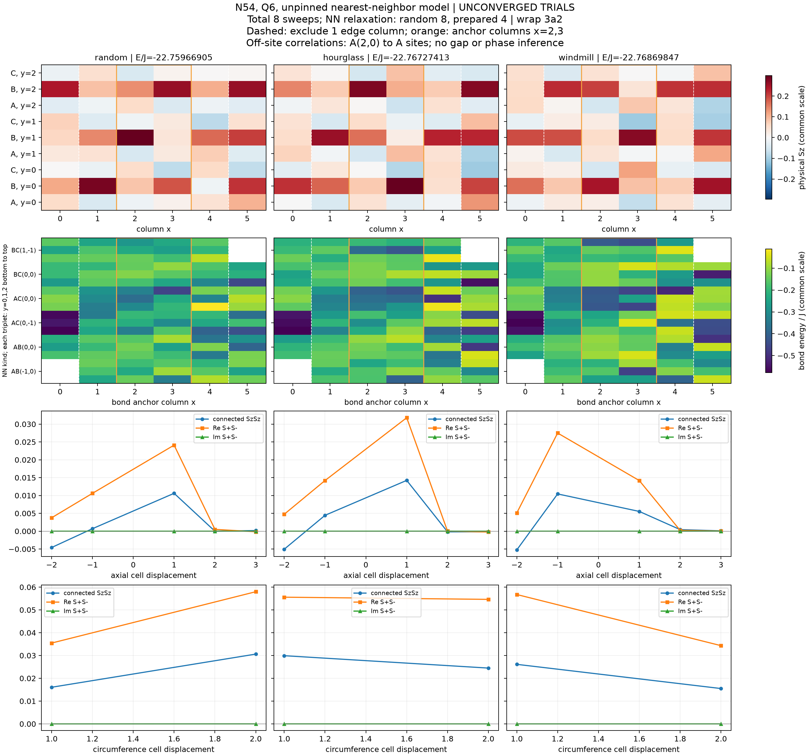

# N54・Q6の結合準備を除いた後の中央構造比較

2026-09-20〜21。対象は最近接・等方Heisenberg模型、N54、Q6、θ=0。
本研究単位は有限χの準備依存を調べるもので、基底状態や相を確定するものではない。

**3枝の準備・除去・追加緩和と保存が完了したが、全枝で5精度条件すべてが未達だった。**
円周の並進を合わせるとhourglass／windmill準備枝の中央bond差は追加2 sweepsで縮んだ。
残る枝間差は各枝の緩和による変化と同程度で、異なる収束状態が残ったとは判断できない。
次は円周整列後の中央bond差が最大のrandom／windmill各保存状態から、同数の追加sweepsをχ128／256で
比較し、緩和不足とχ制限を分ける。この次の比較は未実装・未実行である。

追記（2026-09-22）: この後続比較は[同一親χ128/256研究](p4_vbc54_matched_parent_comparison.md)として
実装・実行した。以下の本文は初回研究時点の記録を保持する。

## 問いと事前に固定した条件

同じ模型・幾何・磁化で、hourglass型とwindmill型の結合準備を除いた後の
中央bond／Sz構造は、無誘導の複素random参照と一致するかを調べる。
文献の波動関数そのものを構築するのではなく、[図から対応付けた結合模様](vbc_motif_mapping.md)
で交換を一時的に変調する。旧period9/27試行の改名ではない。
hourglassは共有頂点を持つbowtieの6辺を選択的に誘導し、文献の全4種類のbond強度は再現しない。
windmillは著者稿v1の4種類のbondを対応付ける。今回の試行だけで文献候補を棄却しない。

幾何は `(Lx,Ly)=(6,3)`、wrap=`3a2`、軸OBC、x→y→A/B/C順。
Nup=30、Ndown=24、総Sz=3。9-site周期と27-site周期に整合するが、
長さ6列は27-site模様の2周期にすぎず、十分なbulkを保証しない。
一様磁場は固定Qで定数となるため加えない。

[固定config](../../examples/configs/vbc54_comparison.toml)は全3枝を一つの比較として
2700秒（45分）、数値worker一つ、Julia/BLAS各1thread、χ上限128とする。
同じsite indices、seed11、初期linkdim4の複素random MPSをコピーして各枝を開始する。
各stageを3枝で終えてから次stageへ進み、時間制限が特定枝だけを優先しない順序にした。

| stage | 誘導枝のλ | 各sweepのχ上限 | 診断 |
| --- | ---: | --- | --- |
| prepare | 0.3 | 32,64 | 保存・再読込・energy・Sz・実測切断 |
| reduce | 0.1 | 128,128 | 同上 |
| release | 0 | 128,128 | 上記と全bond・縦横相関・分散・各列cutのSchmidt |
| relax | 0 | 128,128 | 同上、直前の同じNN模型との変動比較 |

準備は `Jxy_b=Jz_b=1+λ w_b`。無誘導枝は全stageでλ=0。
すべての元NN bondと向き・windingを保ち、λ=0で元のJ=1模型へ厳密に戻す。
各stageでMPOと環境を新たに構築する。複素状態・固定Q・保存の整合性を検査する。
準備模型のenergyは、除去後のNN energyの比較へ混ぜない。

3枝の総sweep数とχ上限履歴は同じだが、最後のNN緩和は誘導枝4 sweeps、
無誘導枝8 sweepsである。従って初回の最終差にはNN緩和時間の影響も含まれ、
準備した秩序の安定性だけを切り出した比較ではない。単一seed・原点・χの探索とする。

## 測定と判断

端除外1列（x=1..4）と2列（x=2,3）を比較する。内部bondは両端が窓内のものだけ。
全energyを変分比較、中央bond energyを局所構造として区別する。
円周yの3並進で同じdomain位置を合わせた差も示す。
開軸xの±1列移動は結果を見た後の追加診断として分離する。準備原点変更は未調査である。
中央anchorからのconnected Sz相関と横相関も保持し、短距離fitでgapを判定しない。

[既存の5精度条件](p4_static_plateau_strategy.md#精度と解釈)を維持する。
release→relaxの全energy差、末尾sweep差、solverとMPO期待値の差の最大値/Nを1e−6 Jと比較し、
Sz・bond変化各1e−4、分散/N≤1e−5 J²、最後の実測切断≤1e−6も個別に記録する。
分散は基底energyの誤差棒ではない。欠測は合格へ置き換えない。

中央差がsweep変動に埋もれれば、相・energy順位を保留し、差を決める少数枝の精度を改善する。
端除外で結論が変われば端・長さ比較を優先する。中央構造が一致してもLy=3の結果を
二次元へ一般化しない。資源内で判別できなければ同じ系列の自動反復を止める。

## 完了した試行と精度

[workerの全記録](data/p4_vbc54_validation.toml)と[外側の実行記録](data/p4_vbc54_execution.toml)
は元の出力のbyte一致コピーである。12段階のcheckpointをtrialとして保存・strict reloadし、
除去後の6診断点ではnorm・Q・bond和・観測量の整合性を通過した。
解析でも全12 checkpointのhash・模型・source・依存環境、全6診断の和則と最終3枝の精度判定を照合した。
計算と保存が完了したことは、物理精度の合格とは区別する。

下表は累積8 sweeps、χ128での値。全energyはJ、分散はJ²、Szは物理単位。
energy精度値は上記3種類の変化の最大値/Nであり、基底energyの誤差推定ではない。

| 枝 | E/J | energy精度値 | max ΔSz | max Δbond/J | 分散/(N J²) | 最終実測切断 |
| --- | ---: | ---: | ---: | ---: | ---: | ---: |
| random | −22.7596690520 | 8.88716e−5 | 0.0444618 | 0.125853 | 0.00160715 | 2.30823e−4 |
| hourglass | −22.7672741288 | 1.43614e−4 | 0.0441129 | 0.174421 | 0.00144109 | 2.09871e−4 |
| windmill | −22.7686984703 | 2.37935e−4 | 0.104028 | 0.145375 | 0.00140213 | 1.67456e−4 |
| 維持した上限 | — | 1e−6 | 1e−4 | 1e−4 | 1e−5 | 1e−6 |

すべて未達。6→8 sweepsの全energy低下は順に0.00479907、0.00775518、0.0128485 J。
最終3枝の全energy幅0.00902942 Jよりwindmillの追加緩和量が大きい。
表のtrial energy大小から収束した順位を付けない。

## 中央構造の差と、その変動

端1列除外は36 sites／66内部bonds、端2列除外は18 sites／30内部bondsである。
次のRMSは円周yの3並進から**bond RMSを最小にする移動**を選び、Szにも同じ移動を使った。
energy値を選択基準にはしない。全並進と未整列値は[機械可読解析](data/p4_vbc54_comparison.json)に残した。

| 最終枝間比較 | 最適dy | 端1列除外 bond RMS/J | 同 Sz RMS | 端2列除外 bond RMS/J | 同 Sz RMS |
| --- | ---: | ---: | ---: | ---: | ---: |
| random → hourglass | 0 | 0.0688722 | 0.0650897 | 0.0677209 | 0.0744753 |
| random → windmill | 1 | 0.0857015 | 0.0586712 | 0.0915287 | 0.0681281 |
| hourglass → windmill | 1 | 0.0321268 | 0.0178224 | 0.0407682 | 0.0212045 |

| 各枝の6→8 sweep変化（同じ座標） | 端1列除外 bond RMS/J | 同 Sz RMS | 端2列除外 bond RMS/J | 同 Sz RMS |
| --- | ---: | ---: | ---: | ---: |
| random | 0.0501150 | 0.0189419 | 0.0625446 | 0.0221322 |
| hourglass | 0.0744324 | 0.0162968 | 0.0984497 | 0.0185729 |
| windmill | 0.0542787 | 0.0467352 | 0.0568394 | 0.0531431 |

hourglass／windmillの端2列除外・整列後bond差は、6 sweepsの0.128790から
8 sweepsの0.0407682へ縮んだ。最終差は両枝それぞれの変化0.0984497、0.0568394より小さい。
未整列での最終差0.119172のかなりの部分は円周domain位置によるが、整列後も一致には至らない。
randomとの差も緩和中の構造変化と同程度であり、別々の収束VBCが残るという証拠にはしない。
両方の端除外幅で最大のbond対比はrandom／windmillだが、端・長さ依存を除いたとは言えない。

中央の共通した特徴として、3枝ともB副格子が正のSzを主に担う。
端2列除外での副格子平均は以下のとおりである。

| 枝 | A | B | C |
| --- | ---: | ---: | ---: |
| random | −0.00194308 | 0.166885 | −0.00683487 |
| hourglass | 0.00003563 | 0.157781 | −0.00219081 |
| windmill | 0.00129984 | 0.149985 | 0.00494622 |

これは当該trialの記述であり、自発的な磁気秩序の確認ではない。共通の初期状態、
termination、狭いwrap、有限χの影響が分離されていない。
全Sz・bond分布と縦横相関は共通スケールの[図](figures/p4_vbc54_profiles.png)に示す。
相関は中央A(2,0)をanchorとしたconnected Sz、および複素横相関で、自己相関を図から除いた。
原データには全行列を保持している。この短い距離範囲からgapや長距離秩序をfitしていない。
bond図の列は始点による表示で、上表の窓は両端を含む条件なので同一の集計ではない。



### 結果を見た後の軸方向domain診断

[別の追加解析](data/p4_vbc54_axial_posthoc.json)でdx=−1,0,+1とdy=0,1,2を調べた。
sourceとtargetの両方をx=1..4内に限り、dx=±1は27 sites／48内部bondsになる。
支持範囲の異なる最小値を直接比べず、各dxの同じsource範囲での最良dyのみの結果と比較した。

| 枝間比較 | dx=−1の最良bond RMS / 同範囲の円周整列RMS | dx=+1の同比 |
| --- | ---: | ---: |
| random → hourglass | 1.56404 | 1.37810 |
| random → windmill | 1.40288 | 1.35619 |
| hourglass → windmill | 3.51510 | 3.93817 |

試した±1列の剛体移動は、どの対でも円周だけの整列より改善しなかった。
開軸の並進は全系の対称操作ではなく、この結果は大きな移動、domain壁の変形、
未収束状態の移動一般を排除しない。事前の主解析JSONの `axial_alignment=not_tested` は
その解析範囲のまま残し、この後追い診断を別ファイルにした。

## 資源実測と次の判断

数値workerは一つ、Julia/BLAS各1thread。外側の単調時計では1514.555秒（25.24分）で
exit code 0を確認し、2700秒上限内で全段階が完了した。CPUは1511.250秒、
子workerのpeak RSSは2.5215 GiBであり、並行process全体の最大合計ではない。
Julia内部の経過時間は1529.641秒で、外側より約15.085秒長い。
この二つの計時の不一致の原因は未調査で、時計を混ぜて性能差を主張しない。
資源上限と終了の判定には外側の記録を使う。入力sourceが実行中に変わらなかったことも確認した。

次は円周整列後の中央bond差が最大のrandomと、準備枝の代表windmillを残す。
windmillを選ぶ理由はtrial energyの低さではない。各枝の累積8-sweep checkpointを共通親として
χ128／256へそれぞれ同じ追加2 sweepsずつ分岐し、固定χでの緩和とχ変更の効果を比較する。
親の出自・依存環境・模型をstrictに照合し、4子状態を一つの計算予算で扱う。
既存の5精度条件に加え、中央の差と各子の変化を同じ二つの窓で比較する。
この実装と資源枠は次の研究単位で固定し、今回は追加走行していない。
中央差が安定するまではN81・幅変更・隣接Qを一律に増やさず、結果で必要な比較を選ぶ。

## 再現と保存

```sh
python3 examples/run_vbc54.py outputs/p4-vbc54-preparation-comparison
python3 examples/analyze_vbc54.py outputs/p4-vbc54-preparation-comparison/validation.toml --output outputs/p4-vbc54-preparation-comparison/analysis.json --figure-prefix outputs/p4-vbc54-preparation-comparison/profiles
python3 examples/analyze_vbc54_axial.py outputs/p4-vbc54-preparation-comparison/validation.toml outputs/p4-vbc54-preparation-comparison/axial.json
```

Python 3.11以降を使い、描画にはNumPyとMatplotlibが必要である。解析だけなら主解析に
`--no-plot` を付ける。既存の出力を上書きしないため、再実行には別の出力先を指定する。
checkpoint本体はignoredな `outputs/` に保持し、上のtracked記録だけではMPSの再読込はできない。

全stageをtrialとして原子的に保存し、準備中は準備Hamiltonianのmetadataを使う。
λ除去後はNN模型との全bond一致を確認する。checkpointのsource・依存環境・site・Q・
Hamiltonian一致条件を維持し、strict reload後に観測する。
外側のexecution記録とworker診断を分け、time-out時にも保存済み段階を残す。
driver/helper/configをhash付きで出力先へ保存し、実行中の変更も検出する。

## 準備・除去の独立検証

[N9の実測記録](data/p4_vbc_preparation_validation.toml)はJulia 1.13.0、各1threadで
起動後のimport/JIT込み73.891秒、13判定を通過した。日常の60秒目安を超えたが、
新しいMPO・保存・DMRG呼出しを含む一度の重点検証とし、既存package suiteは再実行していない。
事前のimport単独確認は3.99秒だったが、この値を数値検証から機械的に差し引かない。

独立Cartesian近接探索とspin-bit行列を使い、N9の全512次元、θ=0.371で
両準備のMPOを比較した。最大差1.11e−15、Hermiticity差8.90e−16未満、
電荷commutator差0。λ=0で元のNN行列への差は8.89e−16未満だった。
geometryと交換演算の構成は独立だが、指定されたmotif weightは共通入力である。
図からの対応は[別の独立幾何監査](data/vbc_motif_independent_audit_20260920.json)と分けている。

小系のprepared→NN warm startと独立EDも一致し、prepared checkpointをNN模型として
読む操作は拒否され、除去後のcheckpointはNNとして再読込できた。
complex型・site indices・固定Qも保持した。これは研究サイズの収束や文献相の校正ではない。
除去後のED energy差/Nは3.45e−16 J、全系残差normは5.63e−14だった。
73.891秒はchecker内部の計時であり、この重点検証には外側のexecution記録はない。

最終データは別agentが独立に再集計し、12 checkpointのhash・metadata、λ=0で全J=1、
全15精度判定の未達、二つの窓の全円周shiftと軸方向追加診断の数値を確認した。
再計算との差は1e−14以内だった。図も表示してレイアウトとラベルを確認した。

## 既知CSL対照

並行した[保存結果の独立再集計と資源判断](p3_csl_resource_decision_20260920.md)では、
N36・χ256の同じ追加sweepで分散・切断の障害が解消していないことを確認した。
非零ポンプ校正は未達。N72・χ512の新規準備を今後の別資源単位として提案し、
今回のNN比較と同時に長時間CSL workerを起動しない。
